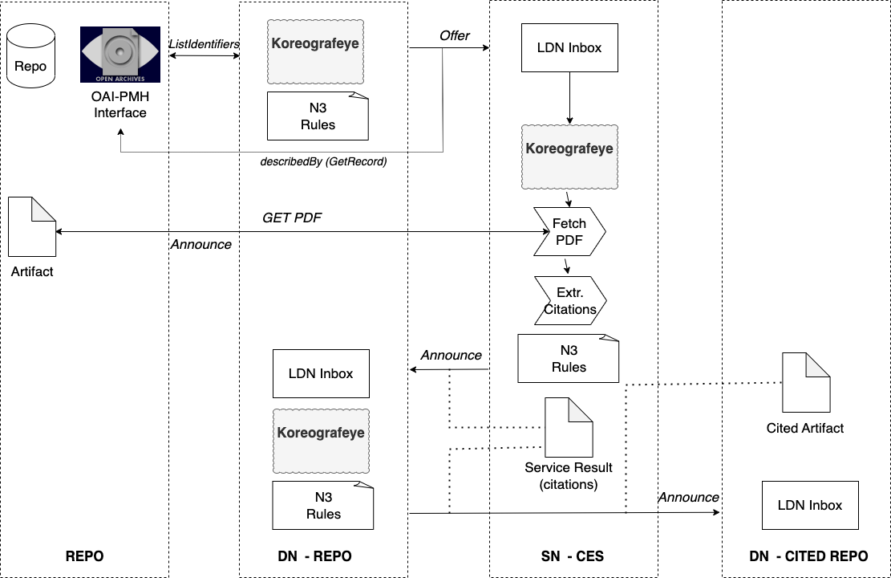

# Citation Extractor Service

The Citation Extractor Service (CES) is a Service Node in a [Value-Adding Network](https://www.eventnotifications.net).

CES watches an LDN Inbox for `as:Announce` notification messages about new published PDF documents. For each PDF document an citation extraction process is executed. For each citation, CES will try to discover its LDN inbox and send an `as:Announce + ex:Citation` notification message.

## Architecture



CES is composed out of the following components:

- **LDN Inbox** - The LDN inbox endpoint from which CES receives incoming notifications about new publications
- **Input Folder** - The storage location of new notification messages
- **orch** - An orchestration components that for each notification message executes one or more N3 rules to defined next actions in the process
- **pol** - A policy executor component that will send out LDN messages for each citation discovered

## Dependencies

- OAI-Bridge - https://github.com/MellonScholarlyCommunication/OAI-Bridge

## Configuration

### config.jsonld

Definition of all orchestration and policy execution plugins that will be used.

- `urn:koreografeye:reasonerInstance` - Definition of the N3 reasoner component
- `http://example.org/sendNotification` - Definition of the LDN sender component
- `http://example.org/extractCitations` - Definition of the PDF citation extraction component
- `http://example.org/serializeAs` - Definition of the N3 store serialization component
- `http://example.org/inboxCreator` - Definition of an LDN inbox creator component (used in local experiments)
- `http://example.org/inboxLocator` - Definition of an LDN inbox discovery component

### rules/extractCitations.n3

An N3 rule file that requests:
 
- for each PDF file that is found in `as:object/as:url` the extraction of citations and mentions 
- the discovery of the LDN inbox for each of these citations
- the generation of a new input file for reasoning

## rules/biblio/sendCitationNotification.n3

An N3 rule file that requests:

- for each citation found the generation of a demonstration LDN inbox
- send the citation as `as:Announce+ex:Citation` message to this LDN inbox

## Demonstration

### 1. Start a Solid CSS server

By starting the CES Solid CSS server, we create an LDN endpoint on port 3000 on localhost.

Open a new terminal and type:

```
npm run solid
```

### 2. Send some OAI-Bridge notifications to the Solid CSS server

OAI-Brige is a project as a bridge between the OAI-PMH protocol and the [Event Notifications in Value-Adding Network](https://www.eventnotifications.net) protocol.

In our examples data from https://biblio.ugent.be (Biblio) will be used.

```
npm run bridge:demo
```

After this step we can find on the Solid server http://localhost:3000/inbox/ some incoming 
`as:Announce` notifications about PDF resources published at in the Biblio repository.

### 3. Process the Solid LDN Inbox and decide what to do with the notifications

In the next step CES will read the LDN Inbox of the Solid instance and for each incoming
`as:Announce` the N3 rules in `rules/extractCitations` will define what the next processing
steps will be for each notification message. The results will be written to the `pre/` directory.

```
npm run extract:preparenpm run extract:prepare
```

The `pre/` directory will now contain for each `as:Announce` notification the required
processing steps. These processing steps "policies" will be executed in the next step

### 4. Execute all policy steps requested in step 3.

In this processing step CES will do the actual PDF extraction of citations and generate a
new output file in the `in` directory for each processed notification.

```
npm run extract:run
```

### 5. Process the citations and decide what to do with them

In this procesing step CES will use N3 rules in `biblio/sendCitationNotifications.n3` to 
decide what to do with the citations found in the previous step.

```
npm run send:prepare
```

The results of this step will be in the `out` directory.

### 6. Execute the final sending of citations to the (external) LDN inboxeso

In the processing step the results of the `out` directory will be executed by the 
policy executer. In our demo the citations will be sent mock LDN inboxes as
http://localhost:3000/experiment/

```
npm run send:run
```